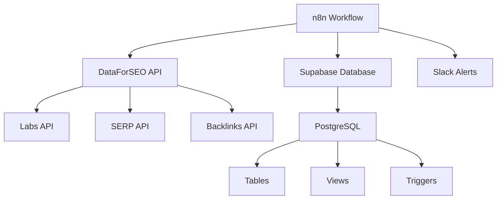
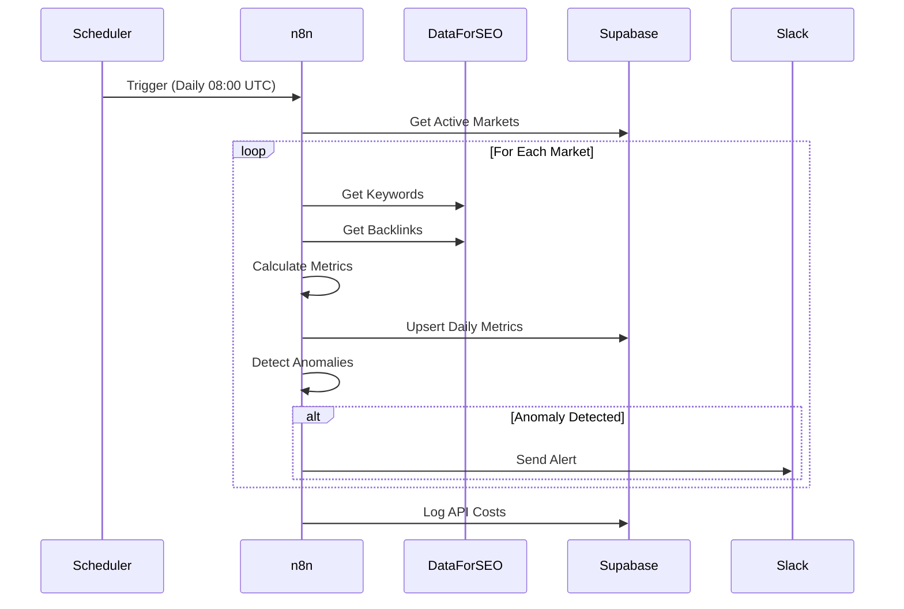

# Project Improvement Recommendations
## IndieCampers SEO Intelligence Pipeline

**Analysis Date:** November 8, 2025
**Project Version:** Based on current main branch
**Analyst:** Claude Code

---

## Executive Summary

This project is well-structured with excellent documentation. The following recommendations will enhance maintainability, security, developer experience, and production readiness.

**Priority Legend:**
- 🔴 **Critical** - Security/data integrity issues
- 🟡 **High** - Significantly improves project quality
- 🟢 **Medium** - Nice to have, improves UX
- 🔵 **Low** - Optional enhancements

---

## 1. Project Structure & Organization

### 🟡 Add .gitignore File
**Current State:** No .gitignore file present
**Issue:** Risk of committing sensitive data, IDE configs, or temporary files

**Recommended .gitignore:**
```gitignore
# Environment and credentials
.env
.env.local
.env.*.local
**/credentials.json
**/service-account-*.json

# n8n specific
.n8n/
n8n-data/

# IDE and editor files
.vscode/
.idea/
*.swp
*.swo
*~
.DS_Store

# Logs
*.log
logs/
npm-debug.log*

# Temporary files
tmp/
temp/
*.tmp

# OS files
Thumbs.db
.DS_Store

# Backup files
*.bak
*.backup
*_backup.json

# Test outputs
test-results/
coverage/
```

**Impact:** Prevents accidental credential leaks and keeps repository clean

---

### 🟢 Add CHANGELOG.md
**Current State:** No changelog tracking project evolution
**Benefit:** Users can see what's new, changed, or fixed

**Template:**
```markdown
# Changelog
All notable changes to this project will be documented in this file.

The format is based on [Keep a Changelog](https://keepachangelog.com/en/1.0.0/).

## [Unreleased]

## [1.1.0] - 2025-11-08
### Added
- Supabase integration with complete schema
- Authority Collector workflow
- Comprehensive setup guides

### Fixed
- Invalid JSON syntax in COMPLETE workflow

## [1.0.0] - 2025-10-26
### Added
- Initial release
- Core SEO intelligence pipeline
- Google Sheets integration
- Multi-market support
```

---

### 🟢 Organize Workflows Directory
**Current State:** 4 workflow files with unclear naming
**Recommendation:** Add README explaining each workflow

**Create:** `/workflows/README.md`
```markdown
# Workflows Directory

## Available Workflows

### 1. seo-intelligence-pipeline.json
**Purpose:** Core SEO intelligence workflow
**Use Case:** Main production workflow for SEO analysis
**Prerequisites:** DataForSEO API, Google Sheets
**Cost:** ~$15-20/run

### 2. COMPLETE-seo-intelligence-pipeline.json
**Purpose:** Extended version with all features
**Use Case:** Full feature set including monitoring
**Status:** ⚠️ Use with caution - higher cost

### 3. Authority_Collector_Supabase.json
**Purpose:** Daily metrics collection with Supabase
**Use Case:** Database-backed metrics tracking
**Prerequisites:** Supabase account
**Cost:** ~$0.60/run

### 4. DEMONSTRATION-workflow.json
**Purpose:** Quick demo/testing
**Use Case:** Learning the workflow structure
**Cost:** Minimal (limited API calls)

## Which Workflow Should I Use?

- **New users:** Start with `DEMONSTRATION-workflow.json`
- **Google Sheets:** Use `seo-intelligence-pipeline.json`
- **Database (recommended):** Use `Authority_Collector_Supabase.json`
- **Full features:** Use `COMPLETE-seo-intelligence-pipeline.json`
```

---

## 2. Documentation Improvements

### 🟡 Add Architecture Diagrams
**Current State:** Text-based architecture description
**Recommendation:** Add visual diagrams using Mermaid

**Create:** `/docs/ARCHITECTURE.md`
```markdown
# Architecture Overview

## System Components



## Data Flow


```

---

### 🟢 Add FAQ Documentation
**Create:** `/docs/FAQ.md`

**Content Areas:**
- Common errors and solutions
- Cost optimization tips
- API rate limit handling
- Data retention policies
- Scaling recommendations
- Backup and recovery procedures

---

### 🟡 Add Video Walkthrough Links
**Recommendation:** Create and link setup video tutorials

**Add to README.md:**
```markdown
## 📺 Video Tutorials

- [5-Minute Quick Start](https://youtube.com/...) - Get up and running fast
- [Complete Setup Walkthrough](https://youtube.com/...) - Detailed 60-min guide
- [Supabase Integration](https://youtube.com/...) - Database setup explained
- [Cost Optimization Tips](https://youtube.com/...) - Reduce monthly costs
```

---

## 3. Code Quality & Validation

### 🟡 Add Workflow Validation Scripts
**Current State:** Manual validation only
**Recommendation:** Add validation scripts

**Create:** `/scripts/validate-workflow.js`
```javascript
#!/usr/bin/env node
/**
 * Validates n8n workflow JSON files
 * Usage: node scripts/validate-workflow.js workflows/seo-intelligence-pipeline.json
 */

const fs = require('fs');
const path = require('path');

function validateWorkflow(filePath) {
  console.log(`\n🔍 Validating: ${filePath}`);

  // Check file exists
  if (!fs.existsSync(filePath)) {
    console.error(`❌ File not found: ${filePath}`);
    process.exit(1);
  }

  // Parse JSON
  let workflow;
  try {
    const content = fs.readFileSync(filePath, 'utf8');
    workflow = JSON.parse(content);
    console.log('✅ Valid JSON syntax');
  } catch (e) {
    console.error(`❌ Invalid JSON: ${e.message}`);
    process.exit(1);
  }

  // Check required fields
  const requiredFields = ['name', 'nodes', 'connections'];
  for (const field of requiredFields) {
    if (!workflow[field]) {
      console.error(`❌ Missing required field: ${field}`);
      process.exit(1);
    }
  }
  console.log('✅ Required fields present');

  // Validate nodes
  if (!Array.isArray(workflow.nodes) || workflow.nodes.length === 0) {
    console.error('❌ No nodes found in workflow');
    process.exit(1);
  }
  console.log(`✅ Found ${workflow.nodes.length} nodes`);

  // Check for credentials placeholders
  const credentialIssues = [];
  workflow.nodes.forEach(node => {
    if (node.credentials) {
      Object.entries(node.credentials).forEach(([key, cred]) => {
        if (cred.id === 'REPLACE_ME' || !cred.id) {
          credentialIssues.push(`Node "${node.name}": ${key} needs credential`);
        }
      });
    }
  });

  if (credentialIssues.length > 0) {
    console.warn('⚠️  Credential warnings:');
    credentialIssues.forEach(issue => console.warn(`   - ${issue}`));
  } else {
    console.log('✅ No obvious credential issues');
  }

  // Check for TODO comments
  const todos = JSON.stringify(workflow).match(/TODO|FIXME|XXX/g);
  if (todos) {
    console.warn(`⚠️  Found ${todos.length} TODO/FIXME comments`);
  }

  console.log('\n✅ Workflow validation complete\n');
}

// Run validation
const workflowPath = process.argv[2];
if (!workflowPath) {
  console.error('Usage: node validate-workflow.js <workflow-file.json>');
  process.exit(1);
}

validateWorkflow(workflowPath);
```

**Add to package.json:**
```json
{
  "scripts": {
    "validate": "node scripts/validate-workflow.js",
    "validate:all": "for f in workflows/*.json; do node scripts/validate-workflow.js $f; done"
  }
}
```

---

### 🟡 Add Schema Validation for Supabase
**Create:** `/scripts/validate-schema.sh`
```bash
#!/bin/bash
# Validates Supabase schema SQL file

echo "🔍 Validating Supabase schema..."

SCHEMA_FILE="config/supabase_schema.sql"

# Check file exists
if [ ! -f "$SCHEMA_FILE" ]; then
    echo "❌ Schema file not found: $SCHEMA_FILE"
    exit 1
fi

# Check for basic SQL syntax
if grep -q "CREATE TABLE" "$SCHEMA_FILE"; then
    echo "✅ Contains CREATE TABLE statements"
else
    echo "❌ No CREATE TABLE statements found"
    exit 1
fi

# Check required tables
REQUIRED_TABLES=("markets" "daily_metrics" "backlinks" "technical_health" "api_costs" "conversation_history")
for table in "${REQUIRED_TABLES[@]}"; do
    if grep -q "CREATE TABLE ${table}" "$SCHEMA_FILE"; then
        echo "✅ Table '${table}' defined"
    else
        echo "❌ Missing table: ${table}"
        exit 1
    fi
done

# Check for views
if grep -q "CREATE VIEW" "$SCHEMA_FILE"; then
    echo "✅ Contains views"
else
    echo "⚠️  No views defined (optional)"
fi

# Check for indexes
if grep -q "CREATE INDEX" "$SCHEMA_FILE"; then
    echo "✅ Contains indexes"
else
    echo "⚠️  No indexes defined (performance may suffer)"
fi

echo ""
echo "✅ Schema validation complete"
```

---

## 4. Security Enhancements

### 🔴 Add Secrets Management Guide
**Current State:** Credentials stored in n8n nodes
**Recommendation:** Document environment variable usage

**Create:** `/docs/SECURITY.md`
```markdown
# Security Best Practices

## Credentials Management

### ❌ NEVER Do This
```javascript
const apiKey = "sk-1234567890abcdef"; // WRONG!
```

### ✅ Always Do This
```javascript
const apiKey = process.env.DATAFORSEO_API_KEY;
if (!apiKey) {
  throw new Error('DATAFORSEO_API_KEY not set');
}
```

## Environment Variables

### n8n Cloud
Set in: Settings → Environment Variables

### Self-Hosted n8n
Create `.env` file (NEVER commit this):
```bash
DATAFORSEO_LOGIN=your-login
DATAFORSEO_PASSWORD=your-api-password
SUPABASE_URL=https://xxx.supabase.co
SUPABASE_SERVICE_KEY=eyJhbGc...
SLACK_WEBHOOK_URL=https://hooks.slack.com/...
```

## Credential Rotation

**Schedule:**
- DataForSEO API: Rotate every 90 days
- Supabase Service Key: Rotate every 180 days
- Slack Webhook: Rotate if compromised

**Process:**
1. Generate new credential
2. Update n8n environment variables
3. Test workflow
4. Revoke old credential
5. Document in password manager

## Access Control

### Supabase RLS (Row Level Security)
```sql
-- Enable RLS on sensitive tables
ALTER TABLE daily_metrics ENABLE ROW LEVEL SECURITY;

-- Policy: Only service role can write
CREATE POLICY "Service role can insert"
  ON daily_metrics FOR INSERT
  TO service_role
  WITH CHECK (true);
```

### n8n Access
- Use separate accounts for team members
- Enable 2FA on n8n account
- Use IP whitelisting if available
- Audit execution logs monthly

## Data Privacy

### GDPR Compliance
- No personal data collected ✅
- Only public SEO data stored ✅
- Data retention policy: 2 years
- Right to deletion: Delete Supabase rows

### Recommended Retention
```sql
-- Auto-delete data older than 2 years
DELETE FROM daily_metrics
WHERE date < CURRENT_DATE - INTERVAL '2 years';
```

## Incident Response

### If Credentials Are Leaked:
1. **Immediately** rotate affected credentials
2. Review recent execution logs for unauthorized access
3. Check Supabase/DataForSEO dashboards for unusual activity
4. Update all team members
5. Document incident

### Emergency Contacts
- n8n Support: support@n8n.io
- DataForSEO: support@dataforseo.com
- Supabase: support@supabase.io
```

---

### 🔴 Add .env.example File
**Create:** `/.env.example`
```bash
# DataForSEO API Credentials
DATAFORSEO_LOGIN=your-login-here
DATAFORSEO_PASSWORD=your-api-password-here

# Supabase Configuration
SUPABASE_URL=https://your-project-id.supabase.co
SUPABASE_SERVICE_KEY=your-service-role-key-here

# Google Sheets (if using)
GOOGLE_SHEET_ID=your-sheet-id-here

# Slack Webhook (optional)
SLACK_WEBHOOK_URL=https://hooks.slack.com/services/YOUR/WEBHOOK/URL

# n8n Configuration (for self-hosted)
N8N_BASIC_AUTH_ACTIVE=true
N8N_BASIC_AUTH_USER=admin
N8N_BASIC_AUTH_PASSWORD=change-this-password

# Environment
NODE_ENV=production
```

---

## 5. Testing & Quality Assurance

### 🟡 Add Automated Test Suite
**Create:** `/tests/integration-test.js`
```javascript
/**
 * Integration test for SEO Intelligence Pipeline
 * Tests workflow components without hitting real APIs
 */

const assert = require('assert');

// Mock DataForSEO response
const mockKeywordData = {
  tasks: [{
    result: [{
      items: [
        { keyword: 'test keyword', rank_absolute: 5, search_volume: 1000 }
      ]
    }]
  }]
};

// Test opportunity score calculation
function testOpportunityScore() {
  console.log('Testing opportunity score calculation...');

  const weights = {
    w1_volume: 0.35,
    w2_click_potential: 0.25,
    w3_serp_features: 0.15,
    w4_keyword_difficulty: 0.15,
    w5_commercial_intent: 0.10
  };

  const keyword = {
    search_volume: 1000,
    click_potential: 0.5,
    has_serp_features: true,
    keyword_difficulty: 30,
    commercial_intent: 0.8
  };

  // Calculate score
  const normalizedVolume = Math.min(keyword.search_volume / 10000, 1);
  const normalizedKD = keyword.keyword_difficulty / 100;

  const score =
    weights.w1_volume * normalizedVolume +
    weights.w2_click_potential * keyword.click_potential +
    weights.w3_serp_features * (keyword.has_serp_features ? 1 : 0) +
    weights.w4_keyword_difficulty * (1 - normalizedKD) +
    weights.w5_commercial_intent * keyword.commercial_intent;

  const finalScore = Math.round(score * 100);

  assert(finalScore >= 0 && finalScore <= 100, 'Score out of range');
  assert(!isNaN(finalScore), 'Score is NaN');

  console.log(`✅ Opportunity score test passed (score: ${finalScore})`);
}

// Test keyword clustering
function testKeywordClustering() {
  console.log('Testing keyword clustering...');

  const keywords = [
    'van hire lisbon',
    'rent van lisbon',
    'campervan rental lisbon',
    'motorhome insurance portugal'
  ];

  // Simple similarity check
  function similarity(a, b) {
    const tokensA = new Set(a.toLowerCase().split(' '));
    const tokensB = new Set(b.toLowerCase().split(' '));
    const intersection = [...tokensA].filter(x => tokensB.has(x)).length;
    const union = new Set([...tokensA, ...tokensB]).size;
    return intersection / union;
  }

  const sim = similarity(keywords[0], keywords[1]);
  assert(sim > 0.5, 'Similar keywords should have high similarity');

  const simDifferent = similarity(keywords[0], keywords[3]);
  assert(simDifferent < 0.5, 'Different keywords should have low similarity');

  console.log('✅ Keyword clustering test passed');
}

// Test data validation
function testDataValidation() {
  console.log('Testing data validation...');

  const testData = [
    { keyword: 'test', search_volume: 1000, opportunity_score: 75 },
    { keyword: 'test2', search_volume: 500, opportunity_score: 50 }
  ];

  // Check for duplicates
  const keywords = testData.map(d => d.keyword);
  const uniqueKeywords = new Set(keywords);
  assert(keywords.length === uniqueKeywords.size, 'Duplicate keywords found');

  // Check score ranges
  testData.forEach(d => {
    assert(d.opportunity_score >= 0 && d.opportunity_score <= 100,
      `Invalid score: ${d.opportunity_score}`);
    assert(Number.isInteger(d.search_volume),
      `Non-integer volume: ${d.search_volume}`);
  });

  console.log('✅ Data validation test passed');
}

// Run all tests
console.log('\n🧪 Running integration tests...\n');
try {
  testOpportunityScore();
  testKeywordClustering();
  testDataValidation();
  console.log('\n✅ All tests passed!\n');
} catch (error) {
  console.error(`\n❌ Test failed: ${error.message}\n`);
  process.exit(1);
}
```

**Add to package.json:**
```json
{
  "scripts": {
    "test": "node tests/integration-test.js",
    "test:watch": "nodemon tests/integration-test.js"
  }
}
```

---

### 🟢 Add Pre-commit Hooks
**Create:** `/.husky/pre-commit`
```bash
#!/bin/sh
. "$(dirname "$0")/_/husky.sh"

echo "🔍 Running pre-commit checks..."

# Validate workflow JSON files
echo "Validating workflows..."
for file in workflows/*.json; do
  if ! python3 -m json.tool "$file" > /dev/null 2>&1; then
    echo "❌ Invalid JSON: $file"
    exit 1
  fi
done

# Check for secrets
echo "Checking for secrets..."
if git diff --cached --name-only | xargs grep -l "sk-\|eyJhbGc\|password.*=.*['\"]" 2>/dev/null; then
  echo "❌ Possible secrets detected! Please review and remove."
  exit 1
fi

echo "✅ Pre-commit checks passed"
```

---

## 6. Developer Experience

### 🟡 Add Development Setup Script
**Create:** `/scripts/setup-dev.sh`
```bash
#!/bin/bash
# Development environment setup script

echo "🚀 Setting up IndieCampers SEO Intelligence development environment..."

# Check prerequisites
command -v node >/dev/null 2>&1 || { echo "❌ Node.js is required but not installed. Aborting." >&2; exit 1; }
command -v git >/dev/null 2>&1 || { echo "❌ Git is required but not installed. Aborting." >&2; exit 1; }

echo "✅ Prerequisites check passed"

# Install dependencies (if package.json exists)
if [ -f package.json ]; then
  echo "📦 Installing dependencies..."
  npm install
fi

# Copy environment template
if [ ! -f .env ]; then
  echo "📝 Creating .env file from template..."
  cp .env.example .env
  echo "⚠️  Please edit .env with your actual credentials"
fi

# Validate workflows
echo "🔍 Validating workflow files..."
for file in workflows/*.json; do
  if python3 -m json.tool "$file" > /dev/null 2>&1; then
    echo "✅ $file is valid"
  else
    echo "❌ $file has JSON errors"
  fi
done

echo ""
echo "✅ Development environment setup complete!"
echo ""
echo "Next steps:"
echo "  1. Edit .env with your credentials"
echo "  2. Review docs/SETUP.md for detailed instructions"
echo "  3. Run 'npm test' to validate setup"
echo ""
```

**Make executable:**
```bash
chmod +x scripts/setup-dev.sh
```

---

### 🟢 Add VS Code Workspace Settings
**Create:** `/.vscode/settings.json`
```json
{
  "files.associations": {
    "*.json": "json"
  },
  "files.exclude": {
    "**/.git": true,
    "**/.DS_Store": true,
    "**/node_modules": true
  },
  "editor.formatOnSave": true,
  "editor.defaultFormatter": "esbenp.prettier-vscode",
  "[json]": {
    "editor.defaultFormatter": "esbenp.prettier-vscode",
    "editor.formatOnSave": true
  },
  "[markdown]": {
    "editor.defaultFormatter": "esbenp.prettier-vscode",
    "editor.wordWrap": "on"
  },
  "files.watcherExclude": {
    "**/.git/objects/**": true,
    "**/node_modules/**": true
  }
}
```

**Create:** `/.vscode/extensions.json`
```json
{
  "recommendations": [
    "esbenp.prettier-vscode",
    "dbaeumer.vscode-eslint",
    "bierner.markdown-mermaid",
    "yzhang.markdown-all-in-one"
  ]
}
```

---

## 7. CI/CD & Automation

### 🟡 Add GitHub Actions Workflow
**Create:** `/.github/workflows/validate.yml`
```yaml
name: Validate Workflows

on:
  push:
    branches: [ main, develop ]
  pull_request:
    branches: [ main ]

jobs:
  validate:
    runs-on: ubuntu-latest

    steps:
    - uses: actions/checkout@v3

    - name: Set up Node.js
      uses: actions/setup-node@v3
      with:
        node-version: '18'

    - name: Install dependencies
      run: |
        if [ -f package.json ]; then npm ci; fi

    - name: Validate JSON syntax
      run: |
        for file in workflows/*.json; do
          echo "Validating $file..."
          python3 -m json.tool "$file" > /dev/null
        done

    - name: Check for secrets
      run: |
        ! git diff origin/main --name-only | xargs grep -l "sk-\|password.*=.*['\"]" || exit 1

    - name: Run tests
      run: |
        if [ -f tests/integration-test.js ]; then
          node tests/integration-test.js
        fi

    - name: Validate documentation links
      run: |
        # Check for broken internal links
        for file in docs/*.md README.md; do
          echo "Checking links in $file..."
          # Add markdown link checker here
        done
```

---

### 🟢 Add Release Automation
**Create:** `/.github/workflows/release.yml`
```yaml
name: Create Release

on:
  push:
    tags:
      - 'v*'

jobs:
  release:
    runs-on: ubuntu-latest

    steps:
    - uses: actions/checkout@v3

    - name: Create Release
      uses: actions/create-release@v1
      env:
        GITHUB_TOKEN: ${{ secrets.GITHUB_TOKEN }}
      with:
        tag_name: ${{ github.ref }}
        release_name: Release ${{ github.ref }}
        body: |
          See [CHANGELOG.md](CHANGELOG.md) for details.
        draft: false
        prerelease: false

    - name: Upload workflow artifacts
      uses: actions/upload-release-asset@v1
      env:
        GITHUB_TOKEN: ${{ secrets.GITHUB_TOKEN }}
      with:
        upload_url: ${{ steps.create_release.outputs.upload_url }}
        asset_path: ./workflows/Authority_Collector_Supabase.json
        asset_name: Authority_Collector_Supabase.json
        asset_content_type: application/json
```

---

## 8. Monitoring & Observability

### 🟡 Add Health Check Endpoint
**Recommendation:** Create monitoring workflow

**Create:** `/workflows/health-check.json` (simplified n8n workflow)
```json
{
  "name": "Health Check",
  "nodes": [
    {
      "name": "Schedule (Every 5 min)",
      "type": "n8n-nodes-base.scheduleTrigger",
      "position": [250, 300],
      "parameters": {
        "rule": {
          "interval": [{ "field": "minutes", "minutesInterval": 5 }]
        }
      }
    },
    {
      "name": "Check Supabase",
      "type": "n8n-nodes-base.supabase",
      "position": [450, 300],
      "parameters": {
        "operation": "getAll",
        "tableId": "markets",
        "returnAll": false,
        "limit": 1
      }
    },
    {
      "name": "Check DataForSEO",
      "type": "n8n-nodes-base.httpRequest",
      "position": [450, 450],
      "parameters": {
        "url": "https://api.dataforseo.com/v3/appendix/user_data",
        "authentication": "predefinedCredentialType",
        "nodeCredentialType": "dataForSeoApi"
      }
    }
  ]
}
```

---

### 🟡 Add Cost Monitoring Dashboard
**Create:** `/docs/COST_MONITORING.md`
```markdown
# Cost Monitoring Guide

## Real-time Cost Tracking

### Supabase Query
```sql
-- Today's costs
SELECT
  operation_type,
  COUNT(*) as calls,
  SUM(cost_usd) as total_cost
FROM api_costs
WHERE DATE(timestamp) = CURRENT_DATE
GROUP BY operation_type
ORDER BY total_cost DESC;

-- Monthly burn rate
SELECT
  DATE_TRUNC('day', timestamp) as day,
  SUM(cost_usd) as daily_cost,
  SUM(SUM(cost_usd)) OVER (
    ORDER BY DATE_TRUNC('day', timestamp)
  ) as cumulative_cost
FROM api_costs
WHERE timestamp >= DATE_TRUNC('month', CURRENT_DATE)
GROUP BY DATE_TRUNC('day', timestamp)
ORDER BY day;
```

### Cost Alerts
Add to workflow:
```javascript
// Check if daily cost exceeds budget
const dailyCost = $json.total_cost;
const budget = 20; // USD

if (dailyCost > budget) {
  // Send alert to Slack
  return [{
    json: {
      alert: true,
      message: `⚠️ Daily cost ($${dailyCost}) exceeds budget ($${budget})`
    }
  }];
}
```

## Budget Optimization

### Current Costs (5 markets, daily)
- DataForSEO: $18/month
- n8n Cloud: $20-50/month
- Supabase: $0 (free tier)
- **Total: $38-68/month**

### Optimization Strategies

#### 1. Reduce Market Frequency
```javascript
// Run expensive markets less often
const marketSchedule = {
  PT: 'daily',    // Primary market
  ES: 'daily',    // Primary market
  FR: 'weekly',   // Secondary market
  DE: 'weekly',   // Secondary market
  UK: 'monthly'   // Low priority market
};
```
**Savings:** ~40% ($15-25/month)

#### 2. Reduce Competitor Count
```javascript
// From 20 to 10 competitors
MAX_COMPETITORS_PER_MARKET: 10
```
**Savings:** ~50% API calls ($9/month)

#### 3. Use Caching
```javascript
// Cache competitor backlinks for 7 days
const cache = {}; // Implement Redis or similar
```
**Savings:** ~30% ($5-8/month)
```

---

## 9. Performance Optimizations

### 🟢 Add Batch Processing
**Recommendation:** Optimize API calls with batching

**Add to documentation:**
```markdown
## Batch Processing Best Practices

### Current Approach (Sequential)
```javascript
for (const competitor of competitors) {
  await getBacklinks(competitor); // 20 API calls
}
```
Duration: 20 * 1 second = 20 seconds

### Optimized Approach (Batched)
```javascript
const batchSize = 5;
for (let i = 0; i < competitors.length; i += batchSize) {
  const batch = competitors.slice(i, i + batchSize);
  await Promise.all(batch.map(c => getBacklinks(c)));
}
```
Duration: (20 / 5) * 1 second = 4 seconds

**Savings:** 75% faster execution
**Risk:** May hit rate limits (monitor carefully)
```

---

### 🟢 Add Caching Strategy
**Create:** `/docs/CACHING.md`
```markdown
# Caching Strategy

## What to Cache

### High Value (cache 7 days)
- Competitor backlink data (changes slowly)
- Domain authority scores
- Historical SERP data

### Medium Value (cache 24 hours)
- Competitor keyword lists
- SERP features

### Don't Cache
- Current rankings (changes daily)
- Real-time metrics
- Daily snapshots

## Implementation

### Using Supabase
```sql
-- Add cache table
CREATE TABLE api_cache (
  cache_key TEXT PRIMARY KEY,
  data JSONB NOT NULL,
  expires_at TIMESTAMP NOT NULL,
  created_at TIMESTAMP DEFAULT NOW()
);

CREATE INDEX idx_cache_expires ON api_cache(expires_at);

-- Auto-delete expired entries
CREATE OR REPLACE FUNCTION cleanup_expired_cache()
RETURNS void AS $$
BEGIN
  DELETE FROM api_cache WHERE expires_at < NOW();
END;
$$ LANGUAGE plpgsql;

-- Run cleanup daily
SELECT cron.schedule('cleanup-cache', '0 2 * * *', 'SELECT cleanup_expired_cache()');
```

### In n8n Workflow
```javascript
// Check cache first
const cacheKey = `backlinks_${domain}`;
const cached = await supabase
  .from('api_cache')
  .select('data')
  .eq('cache_key', cacheKey)
  .gt('expires_at', new Date().toISOString())
  .single();

if (cached.data) {
  return cached.data.data; // Use cached data
}

// Fetch fresh data
const freshData = await dataForSEO.getBacklinks(domain);

// Store in cache
await supabase.from('api_cache').upsert({
  cache_key: cacheKey,
  data: freshData,
  expires_at: new Date(Date.now() + 7 * 24 * 60 * 60 * 1000) // 7 days
});

return freshData;
```
```

---

## 10. Community & Contribution

### 🟢 Add CONTRIBUTING.md
**Create:** `/CONTRIBUTING.md`
```markdown
# Contributing to IndieCampers SEO Intelligence

Thank you for your interest in contributing! This document provides guidelines for contributing to this project.

## Getting Started

1. Fork the repository
2. Clone your fork: `git clone https://github.com/YOUR-USERNAME/indiecampers-seo-intelligence.git`
3. Create a branch: `git checkout -b feature/your-feature-name`
4. Run setup script: `./scripts/setup-dev.sh`

## Development Guidelines

### Code Style
- Use clear, descriptive variable names
- Comment complex logic
- Follow existing patterns in workflow nodes
- Keep nodes focused (single responsibility)

### Workflow Modifications
- Test thoroughly before committing
- Validate JSON syntax
- Update documentation
- Add comments in node descriptions

### Documentation
- Update README.md if adding major features
- Add examples for new functionality
- Keep setup guides current
- Update CHANGELOG.md

## Submitting Changes

1. **Test your changes**
   ```bash
   npm test
   npm run validate:all
   ```

2. **Commit with clear messages**
   ```bash
   git commit -m "feat: add caching for backlink data"
   git commit -m "fix: correct OpportunityScore calculation"
   git commit -m "docs: update Supabase setup guide"
   ```

3. **Push to your fork**
   ```bash
   git push origin feature/your-feature-name
   ```

4. **Create Pull Request**
   - Use clear title and description
   - Reference related issues
   - Include screenshots if UI changes
   - List breaking changes

## Pull Request Guidelines

### PR Title Format
```
<type>: <description>

Types:
- feat: New feature
- fix: Bug fix
- docs: Documentation changes
- perf: Performance improvement
- refactor: Code refactoring
- test: Adding tests
- chore: Maintenance tasks
```

### PR Description Template
```markdown
## Description
Brief description of changes

## Changes Made
- Change 1
- Change 2

## Testing
- [ ] Tested locally with dry run
- [ ] Validated JSON syntax
- [ ] Updated documentation
- [ ] No secrets committed

## Screenshots (if applicable)
[Add screenshots]

## Breaking Changes
[List any breaking changes]
```

## Reporting Bugs

### Bug Report Template
```markdown
**Describe the bug**
Clear description of the bug

**To Reproduce**
Steps to reproduce:
1. Configure workflow with...
2. Run execution...
3. See error...

**Expected behavior**
What you expected to happen

**Screenshots**
Add screenshots if helpful

**Environment:**
- n8n version:
- Workflow version:
- DataForSEO API:

**Additional context**
Any other relevant information
```

## Feature Requests

We welcome feature requests! Please:
1. Check existing issues first
2. Describe the use case
3. Explain expected behavior
4. Consider implementation complexity

## Code of Conduct

- Be respectful and inclusive
- Provide constructive feedback
- Focus on the code, not the person
- Help newcomers

## Questions?

- Open a GitHub Issue
- Join discussions
- Tag @Kr8thor for urgent matters

## Recognition

Contributors will be recognized in:
- README.md contributors section
- Release notes
- Project documentation

Thank you for contributing! 🎉
```

---

### 🟢 Add Issue Templates
**Create:** `/.github/ISSUE_TEMPLATE/bug_report.md`
```markdown
---
name: Bug Report
about: Report a bug in the workflow
title: '[BUG] '
labels: bug
assignees: ''
---

**Describe the bug**
A clear description of what the bug is.

**To Reproduce**
Steps to reproduce:
1. Go to '...'
2. Click on '...'
3. See error

**Expected behavior**
What you expected to happen.

**Screenshots**
Add screenshots if applicable.

**Environment:**
- n8n Version: [e.g. 0.235.0]
- Workflow: [e.g. Authority_Collector_Supabase.json]
- DataForSEO Plan: [e.g. Standard]

**Additional context**
Add any other context about the problem.
```

**Create:** `/.github/ISSUE_TEMPLATE/feature_request.md`
```markdown
---
name: Feature Request
about: Suggest a new feature
title: '[FEATURE] '
labels: enhancement
assignees: ''
---

**Is your feature request related to a problem?**
A clear description of the problem.

**Describe the solution you'd like**
A clear description of what you want to happen.

**Describe alternatives you've considered**
Other solutions you've considered.

**Additional context**
Add any other context or screenshots.

**Estimated complexity:**
- [ ] Low (configuration change)
- [ ] Medium (new node/modification)
- [ ] High (major workflow change)
```

---

## 11. Additional Enhancements

### 🟢 Add License File
**Create:** `/LICENSE`
```
MIT License

Copyright (c) 2025 IndieCampers SEO Intelligence Team

Permission is hereby granted, free of charge, to any person obtaining a copy
of this software and associated documentation files (the "Software"), to deal
in the Software without restriction, including without limitation the rights
to use, copy, modify, merge, publish, distribute, sublicense, and/or sell
copies of the Software, and to permit persons to whom the Software is
furnished to do so, subject to the following conditions:

[Standard MIT License text]
```

---

### 🟢 Add Code of Conduct
**Create:** `/CODE_OF_CONDUCT.md` based on [Contributor Covenant](https://www.contributor-covenant.org/)

---

### 🟡 Add Performance Benchmarking
**Create:** `/scripts/benchmark.js`
```javascript
/**
 * Benchmark workflow performance
 * Tracks execution time and API call efficiency
 */

const fs = require('fs');

class WorkflowBenchmark {
  constructor() {
    this.metrics = {
      startTime: Date.now(),
      apiCalls: 0,
      dataFetched: 0,
      errors: 0
    };
  }

  trackAPICall(cost, dataSize) {
    this.metrics.apiCalls++;
    this.metrics.dataFetched += dataSize;
  }

  trackError(error) {
    this.metrics.errors++;
  }

  report() {
    const duration = (Date.now() - this.metrics.startTime) / 1000;

    return {
      duration: `${duration}s`,
      apiCalls: this.metrics.apiCalls,
      callsPerSecond: (this.metrics.apiCalls / duration).toFixed(2),
      dataFetched: `${(this.metrics.dataFetched / 1024).toFixed(2)} KB`,
      errors: this.metrics.errors,
      efficiency: this.metrics.errors === 0 ? 'Perfect' : 'Has issues'
    };
  }

  save(filename) {
    const report = this.report();
    fs.writeFileSync(filename, JSON.stringify(report, null, 2));
    console.log('Benchmark saved to', filename);
  }
}

module.exports = WorkflowBenchmark;
```

---

## 12. Priority Implementation Roadmap

### Phase 1: Critical (Week 1)
1. ✅ Add .gitignore file
2. ✅ Add .env.example file
3. ✅ Add SECURITY.md with credentials best practices
4. ✅ Add workflow validation script

### Phase 2: High Priority (Week 2)
1. ✅ Add CHANGELOG.md
2. ✅ Add CONTRIBUTING.md
3. ✅ Add GitHub Actions for validation
4. ✅ Add testing suite
5. ✅ Add cost monitoring documentation

### Phase 3: Medium Priority (Week 3-4)
1. ✅ Add architecture diagrams
2. ✅ Add FAQ documentation
3. ✅ Add pre-commit hooks
4. ✅ Add VS Code workspace settings
5. ✅ Add caching strategy documentation

### Phase 4: Nice to Have (Month 2)
1. ✅ Add video tutorial links (when created)
2. ✅ Add performance benchmarking
3. ✅ Add health check workflow
4. ✅ Add release automation
5. ✅ Add LICENSE and CODE_OF_CONDUCT

---

## Summary of Benefits

### Security
- ✅ Prevents credential leaks
- ✅ Documents security best practices
- ✅ Adds secret scanning
- ✅ Implements access control guidelines

### Quality
- ✅ Automated validation prevents bugs
- ✅ Testing suite ensures reliability
- ✅ Pre-commit hooks catch issues early
- ✅ Code review guidelines maintain standards

### Developer Experience
- ✅ Faster onboarding with setup scripts
- ✅ Clear contribution guidelines
- ✅ Better IDE integration
- ✅ Automated repetitive tasks

### Operations
- ✅ Cost monitoring prevents overruns
- ✅ Performance tracking identifies bottlenecks
- ✅ Health checks ensure uptime
- ✅ Caching reduces API costs

### Community
- ✅ Clear contribution process
- ✅ Issue templates guide bug reports
- ✅ Recognition for contributors
- ✅ Professional project image

---

## Estimated Implementation Effort

| Category | Tasks | Effort | Priority |
|----------|-------|--------|----------|
| Security | 4 | 4 hours | Critical |
| Documentation | 8 | 8 hours | High |
| Testing | 3 | 6 hours | High |
| CI/CD | 3 | 4 hours | Medium |
| Dev Tools | 5 | 3 hours | Medium |
| **Total** | **23** | **25 hours** | - |

---

## Next Steps

1. **Review this document** with the team
2. **Prioritize** which improvements to implement first
3. **Create GitHub issues** for each improvement
4. **Assign owners** to each task
5. **Set milestones** for completion
6. **Track progress** in project board

---

**Document Version:** 1.0
**Last Updated:** November 8, 2025
**Maintained By:** Claude Code Analysis Team
