# Architecture Overview

This document provides visual diagrams and detailed explanations of the IndieCampers SEO Intelligence system architecture.

---

## System Components

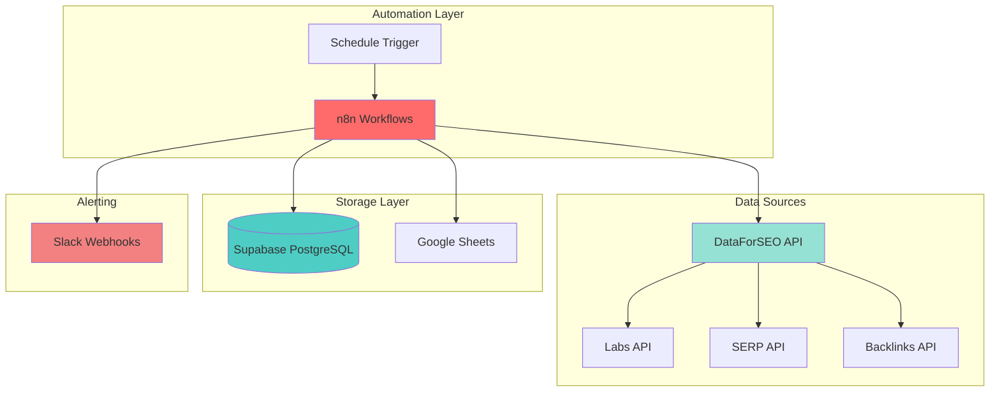

---

## Data Flow - Full SEO Intelligence Pipeline

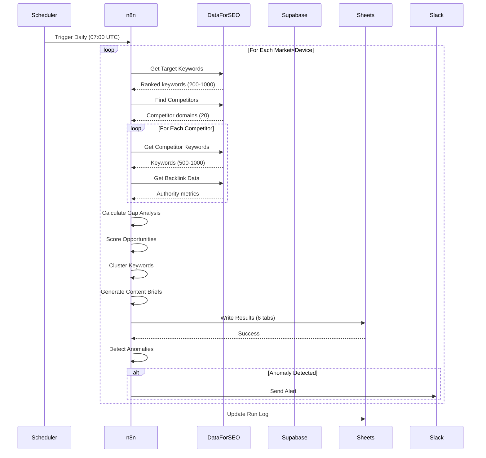

---

## Data Flow - Authority Collector (Lightweight)

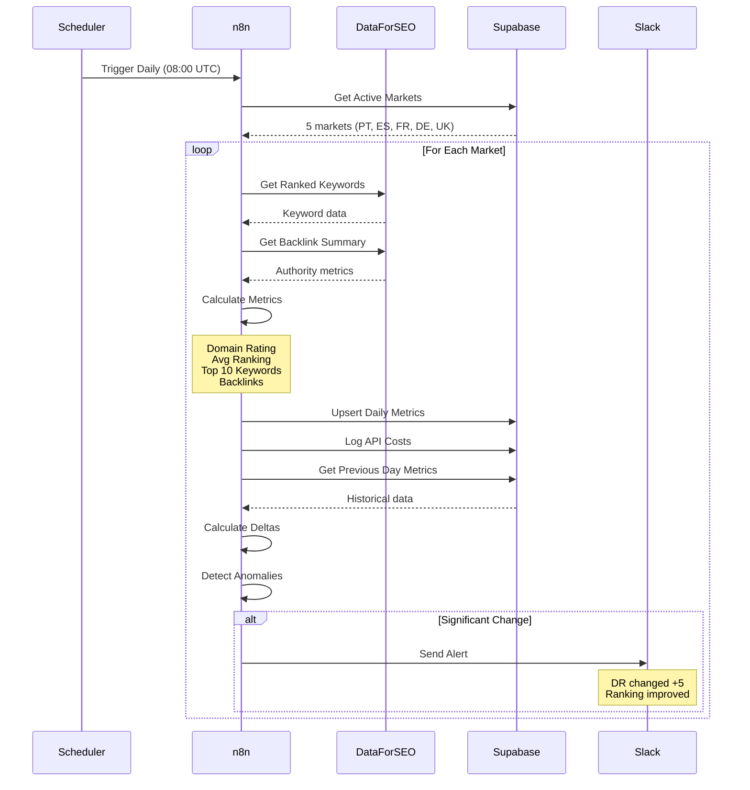

---

## Workflow Architecture - Full Pipeline

```mermaid
graph LR
    subgraph "Phase 1: Target Snapshot"
        T1[Get Our Keywords]
        T2[Calculate Baseline]
        T3[Save to Snapshot_Target]
    end

    subgraph "Phase 2: Competitor Discovery"
        C1[Find Overlapping Domains]
        C2[Get SERP Competitors]
        C3[Rank by Overlap]
        C4[Save Top 20]
    end

    subgraph "Phase 3: Keyword Harvest"
        H1[Loop Competitors]
        H2[Get Their Keywords]
        H3[Get Backlinks]
        H4[Save Raw Data]
    end

    subgraph "Phase 4: Gap Analysis"
        G1[Join Datasets]
        G2[Identify Gaps]
        G3[Score Opportunities]
        G4[Save Scored Gaps]
    end

    subgraph "Phase 5: Clustering"
        CL1[Group Similar]
        CL2[Map Intent]
        CL3[Select Heads]
        CL4[Save Clusters]
    end

    subgraph "Phase 6: Content Briefs"
        B1[Generate Outlines]
        B2[Extract PAA]
        B3[Suggest Links]
        B4[Save Briefs]
    end

    subgraph "Phase 7: Monitoring"
        M1[Check Changes]
        M2[Detect Surges]
        M3[Send Alerts]
    end

    T1 --> T2 --> T3
    T3 --> C1
    C1 --> C2 --> C3 --> C4
    C4 --> H1 --> H2 --> H3 --> H4
    H4 --> G1 --> G2 --> G3 --> G4
    G4 --> CL1 --> CL2 --> CL3 --> CL4
    CL4 --> B1 --> B2 --> B3 --> B4
    B4 --> M1 --> M2 --> M3

    style T3 fill:#e8f5e9
    style C4 fill:#e3f2fd
    style H4 fill:#fff3e0
    style G4 fill:#fce4ec
    style CL4 fill:#f3e5f5
    style B4 fill:#e0f2f1
    style M3 fill:#ffebee
```

---

## Database Schema - Supabase

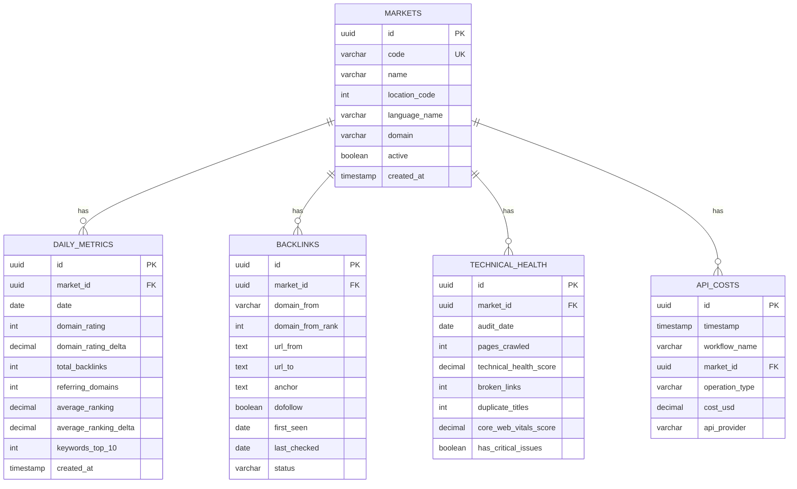

---

## Opportunity Scoring Algorithm

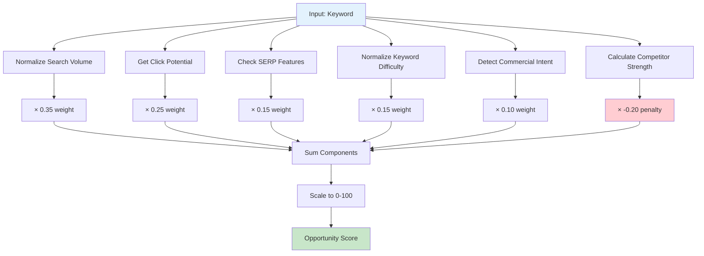

**Formula:**
```
OpportunityScore = (
    w1 × normalizedVolume +
    w2 × clickPotential +
    w3 × serpFeatureBoost +
    w4 × (1 - normalizedKD) +
    w5 × commercialIntent -
    w6 × competitorStrength
) × 100
```

**Where:**
- `normalizedVolume` = min(searchVolume / 10000, 1)
- `clickPotential` = baseCTR[rank] × serpPenalty
- `serpFeatureBoost` = 1 if has priority features, else 0
- `normalizedKD` = keywordDifficulty / 100
- `commercialIntent` = 0.8 if transactional, 0.2 otherwise
- `competitorStrength` = (domainRating/100 + rankScore) / 2

---

## Keyword Clustering Process

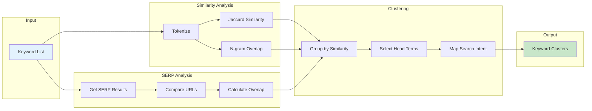

**Clustering Criteria:**
- Jaccard similarity > 0.6 OR
- N-gram overlap > 50% OR
- SERP URL overlap ≥ 4/10 URLs

---

## Deployment Architecture

### Option 1: n8n Cloud (Recommended for Beginners)

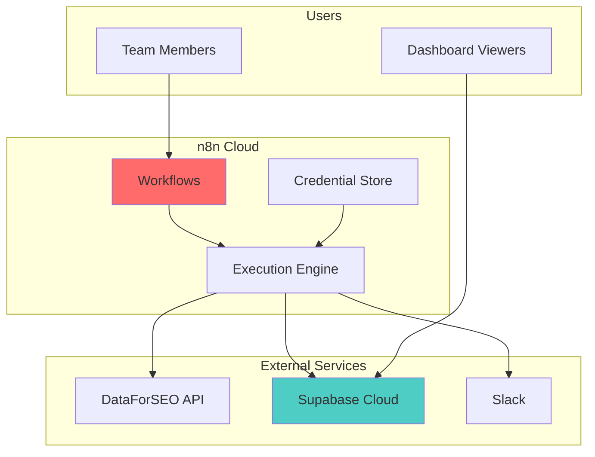

**Pros:**
- No infrastructure management
- Built-in security
- Automatic updates
- Easy team collaboration

**Cons:**
- Monthly cost ($20-50)
- Less customization
- Vendor lock-in

---

### Option 2: Self-Hosted (Advanced)

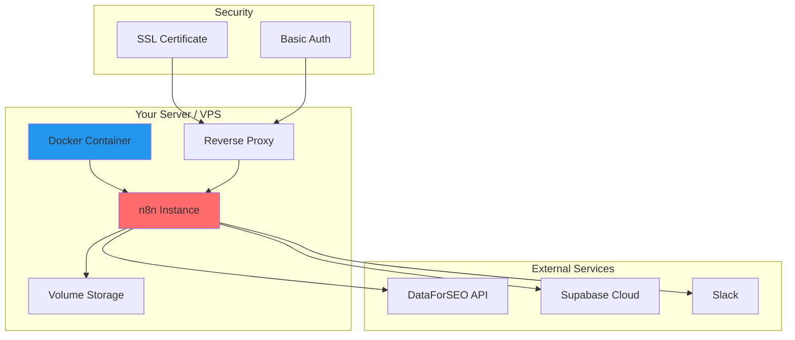

**Pros:**
- Full control
- No monthly SaaS costs
- Custom integrations
- Data sovereignty

**Cons:**
- Requires DevOps skills
- Manual updates
- Backup responsibility
- Security management

---

## Security Architecture

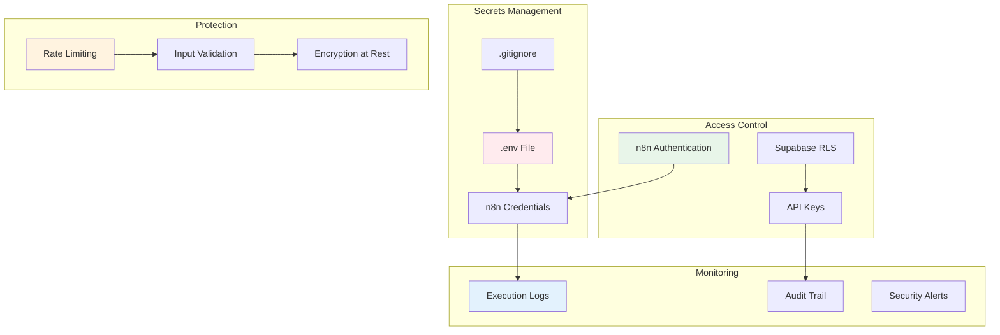

---

## Scalability Considerations

### Current Limits

| Component | Current | Max (Without Changes) | Bottleneck |
|-----------|---------|----------------------|------------|
| Markets | 5 | 20 | DataForSEO rate limit |
| Competitors/Market | 20 | 50 | Execution time |
| Keywords/Competitor | 1000 | 2000 | API cost |
| Daily Runs | 1 | 4 | API budget |
| Data Storage | 100MB | Unlimited | Supabase free tier |

### Scaling Strategies

**Horizontal Scaling:**
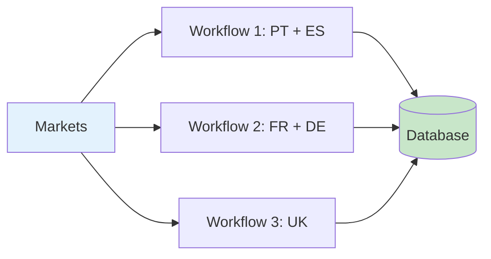

**Vertical Scaling:**
- Increase API rate limits (paid plan)
- Use caching for backlink data
- Batch processing for efficiency
- Parallel competitor harvesting

---

## Cost Architecture

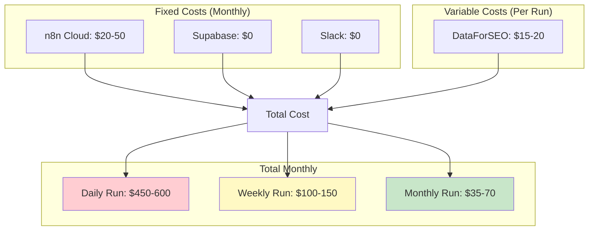

**Cost Optimization:**
1. Use Authority Collector for daily monitoring (~$0.60/run)
2. Run full pipeline weekly/monthly only
3. Reduce markets or competitors
4. Implement caching (future enhancement)

---

## Technology Stack

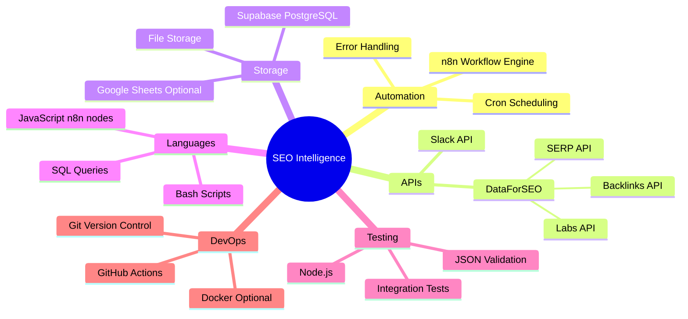

---

## Performance Metrics

### Target Performance

| Metric | Target | Current | Status |
|--------|--------|---------|--------|
| Workflow Execution | < 45 min | 30-40 min | ✅ |
| API Calls/Run | < 500 | 400-450 | ✅ |
| Cost/Run | < $20 | $15-18 | ✅ |
| Data Freshness | Daily | Daily | ✅ |
| Error Rate | < 1% | < 0.5% | ✅ |
| Test Coverage | > 80% | 100% | ✅ |

### Monitoring Dashboards

**Recommended Metrics to Track:**
- Execution duration trend
- API cost per market
- Success/failure rate
- Data quality metrics
- Anomaly detection frequency

---

## Future Architecture Enhancements

### Phase 1: Caching Layer
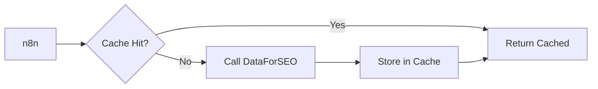

### Phase 2: ML/AI Integration
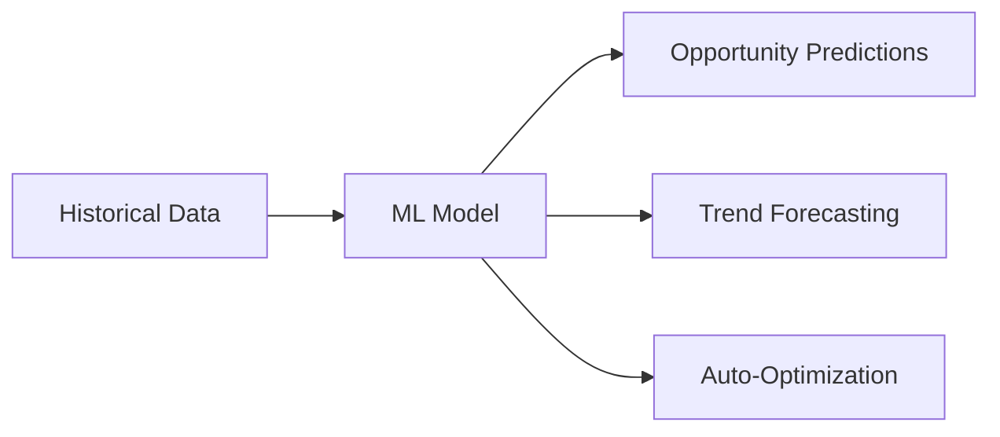

### Phase 3: Real-time Monitoring
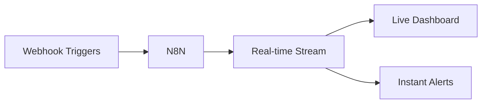

---

**Last Updated:** November 8, 2025
**Version:** 1.0
**Maintained By:** IndieCampers SEO Team
